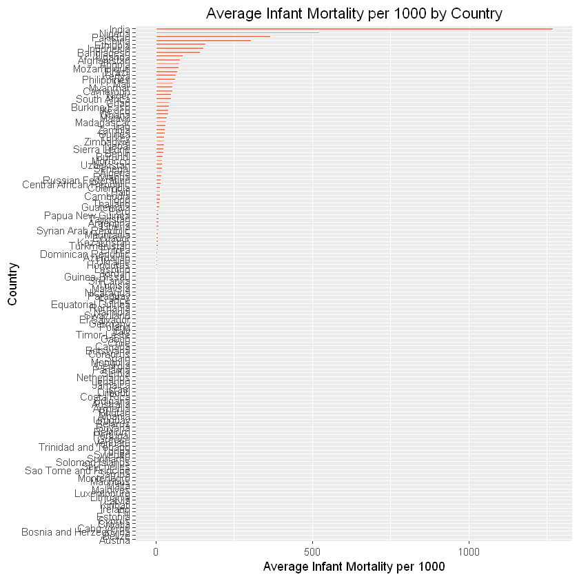
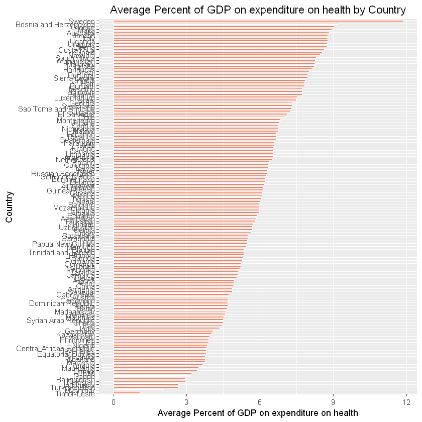
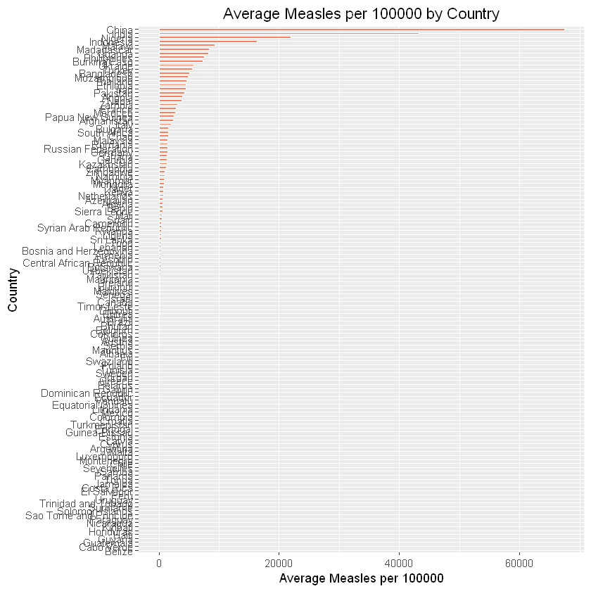
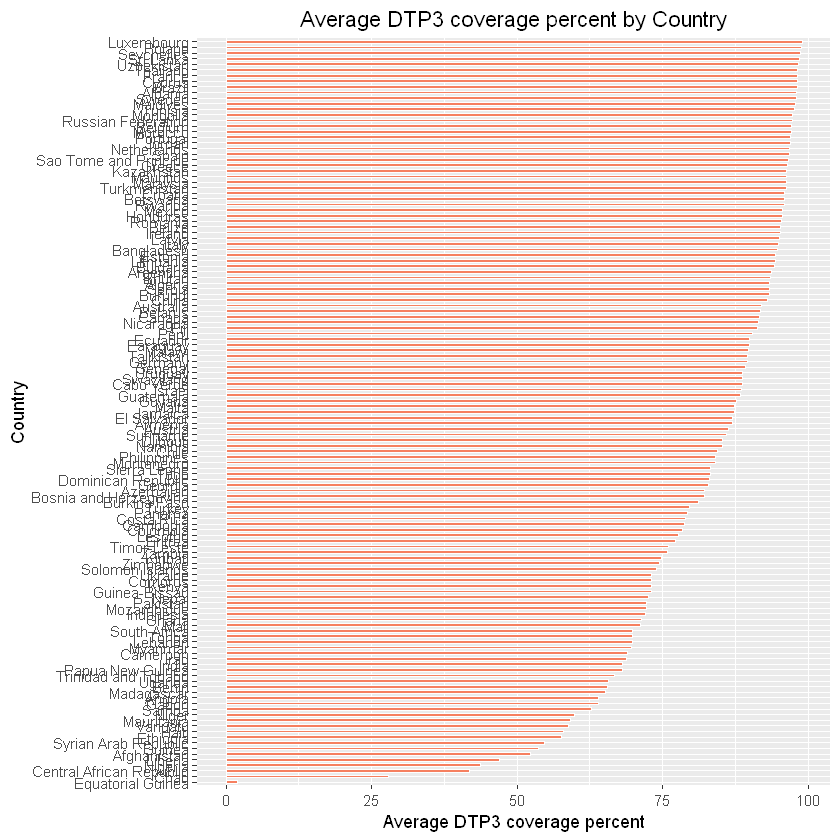
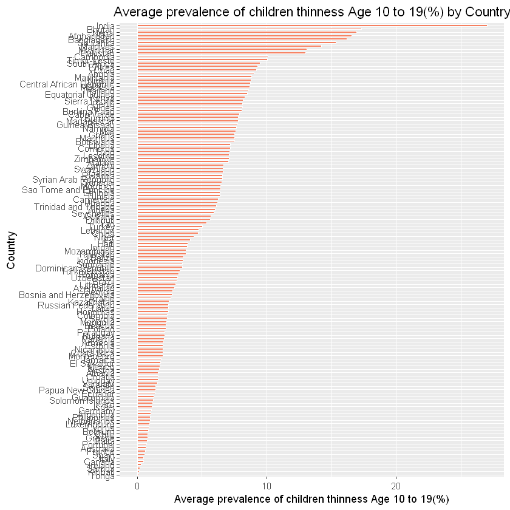
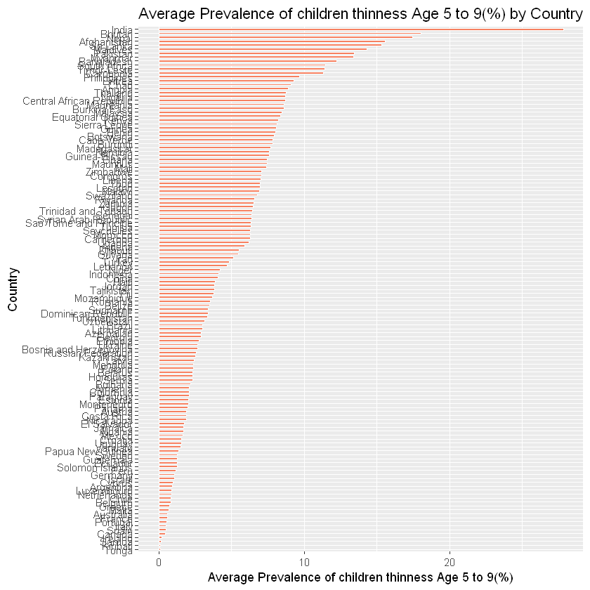
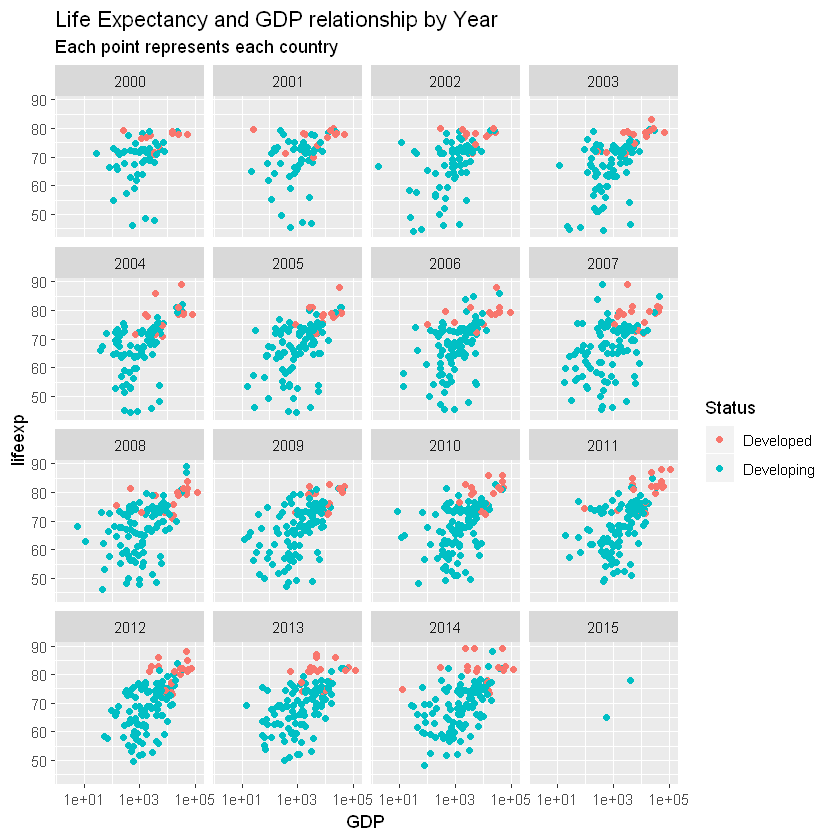
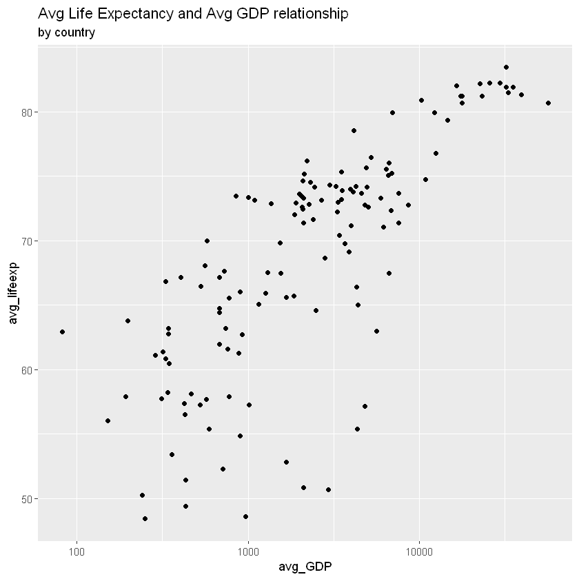
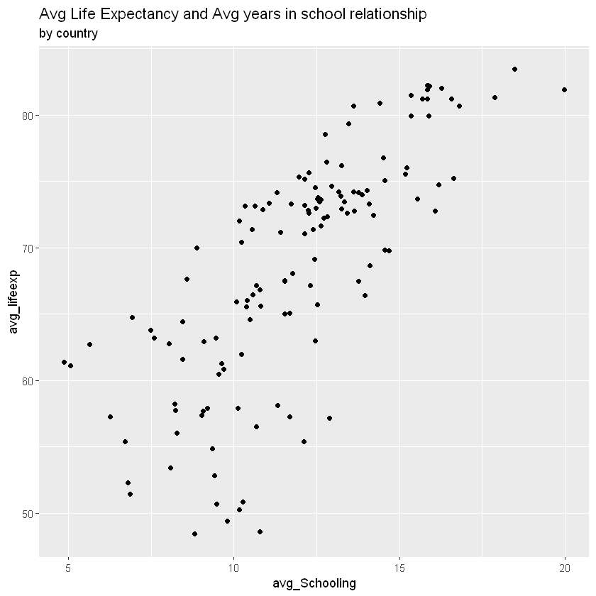

# WHO-Life-Expectancy


#### Data set:https://www.kaggle.com/kumarajarshi/life-expectancy-who

```R
library(dplyr)
library(tidyr)
library(ggplot2)
library(tidyverse)
library(lubridate)
library(forcats)
library(gridExtra)
```


```R
data<-read.csv("Life Expectancy Data.csv")
```


```R
head(data)
```


<table>
<thead><tr><th scope=col>Country</th><th scope=col>Year</th><th scope=col>Status</th><th scope=col>Life.expectancy</th><th scope=col>Adult.Mortality</th><th scope=col>infant.deaths</th><th scope=col>Alcohol</th><th scope=col>percentage.expenditure</th><th scope=col>Hepatitis.B</th><th scope=col>Measles</th><th scope=col>...</th><th scope=col>Polio</th><th scope=col>Total.expenditure</th><th scope=col>Diphtheria</th><th scope=col>HIV.AIDS</th><th scope=col>GDP</th><th scope=col>Population</th><th scope=col>thinness..1.19.years</th><th scope=col>thinness.5.9.years</th><th scope=col>Income.composition.of.resources</th><th scope=col>Schooling</th></tr></thead>
<tbody>
	<tr><td>Afghanistan</td><td>2015       </td><td>Developing </td><td>65.0       </td><td>263        </td><td>62         </td><td>0.01       </td><td>71.279624  </td><td>65         </td><td>1154       </td><td>...        </td><td> 6         </td><td>8.16       </td><td>65         </td><td>0.1        </td><td>584.25921  </td><td>33736494   </td><td>17.2       </td><td>17.3       </td><td>0.479      </td><td>10.1       </td></tr>
	<tr><td>Afghanistan</td><td>2014       </td><td>Developing </td><td>59.9       </td><td>271        </td><td>64         </td><td>0.01       </td><td>73.523582  </td><td>62         </td><td> 492       </td><td>...        </td><td>58         </td><td>8.18       </td><td>62         </td><td>0.1        </td><td>612.69651  </td><td>  327582   </td><td>17.5       </td><td>17.5       </td><td>0.476      </td><td>10.0       </td></tr>
	<tr><td>Afghanistan</td><td>2013       </td><td>Developing </td><td>59.9       </td><td>268        </td><td>66         </td><td>0.01       </td><td>73.219243  </td><td>64         </td><td> 430       </td><td>...        </td><td>62         </td><td>8.13       </td><td>64         </td><td>0.1        </td><td>631.74498  </td><td>31731688   </td><td>17.7       </td><td>17.7       </td><td>0.470      </td><td> 9.9       </td></tr>
	<tr><td>Afghanistan</td><td>2012       </td><td>Developing </td><td>59.5       </td><td>272        </td><td>69         </td><td>0.01       </td><td>78.184215  </td><td>67         </td><td>2787       </td><td>...        </td><td>67         </td><td>8.52       </td><td>67         </td><td>0.1        </td><td>669.95900  </td><td> 3696958   </td><td>17.9       </td><td>18.0       </td><td>0.463      </td><td> 9.8       </td></tr>
	<tr><td>Afghanistan</td><td>2011       </td><td>Developing </td><td>59.2       </td><td>275        </td><td>71         </td><td>0.01       </td><td> 7.097109  </td><td>68         </td><td>3013       </td><td>...        </td><td>68         </td><td>7.87       </td><td>68         </td><td>0.1        </td><td> 63.53723  </td><td> 2978599   </td><td>18.2       </td><td>18.2       </td><td>0.454      </td><td> 9.5       </td></tr>
	<tr><td>Afghanistan</td><td>2010       </td><td>Developing </td><td>58.8       </td><td>279        </td><td>74         </td><td>0.01       </td><td>79.679367  </td><td>66         </td><td>1989       </td><td>...        </td><td>66         </td><td>9.20       </td><td>66         </td><td>0.1        </td><td>553.32894  </td><td> 2883167   </td><td>18.4       </td><td>18.4       </td><td>0.448      </td><td> 9.2       </td></tr>
</tbody>
</table>


```R
colnames(data)
```


<ol class=list-inline>
	<li>'Country'</li>
	<li>'Year'</li>
	<li>'Status'</li>
	<li>'lifeexp'</li>
	<li>'admort'</li>
	<li>'infmort'</li>
	<li>'Alcohol'</li>
	<li>'totexp'</li>
	<li>'HBV'</li>
	<li>'Measles'</li>
	<li>'BMI'</li>
	<li>'u5deaths'</li>
	<li>'Polio'</li>
	<li>'perc.exp'</li>
	<li>'Diphtheria'</li>
	<li>'HIV'</li>
	<li>'GDP'</li>
	<li>'Population'</li>
	<li>'thinness..1.19.years'</li>
	<li>'thinness.5.9.years'</li>
	<li>'Income.composition.of.resources'</li>
	<li>'Schooling'</li>
</ol>


```R
summary(data)
```


                    Country          Year             Status     Life.expectancy
     Afghanistan        :  16   Min.   :2000   Developed : 512   Min.   :36.30  
     Albania            :  16   1st Qu.:2004   Developing:2426   1st Qu.:63.10  
     Algeria            :  16   Median :2008                     Median :72.10  
     Angola             :  16   Mean   :2008                     Mean   :69.22  
     Antigua and Barbuda:  16   3rd Qu.:2012                     3rd Qu.:75.70  
     Argentina          :  16   Max.   :2015                     Max.   :89.00  
     (Other)            :2842                                    NA's   :10     
     Adult.Mortality infant.deaths       Alcohol        percentage.expenditure
     Min.   :  1.0   Min.   :   0.0   Min.   : 0.0100   Min.   :    0.000     
     1st Qu.: 74.0   1st Qu.:   0.0   1st Qu.: 0.8775   1st Qu.:    4.685     
     Median :144.0   Median :   3.0   Median : 3.7550   Median :   64.913     
     Mean   :164.8   Mean   :  30.3   Mean   : 4.6029   Mean   :  738.251     
     3rd Qu.:228.0   3rd Qu.:  22.0   3rd Qu.: 7.7025   3rd Qu.:  441.534     
     Max.   :723.0   Max.   :1800.0   Max.   :17.8700   Max.   :19479.912     
     NA's   :10                       NA's   :194                             
      Hepatitis.B       Measles              BMI        under.five.deaths
     Min.   : 1.00   Min.   :     0.0   Min.   : 1.00   Min.   :   0.00  
     1st Qu.:77.00   1st Qu.:     0.0   1st Qu.:19.30   1st Qu.:   0.00  
     Median :92.00   Median :    17.0   Median :43.50   Median :   4.00  
     Mean   :80.94   Mean   :  2419.6   Mean   :38.32   Mean   :  42.04  
     3rd Qu.:97.00   3rd Qu.:   360.2   3rd Qu.:56.20   3rd Qu.:  28.00  
     Max.   :99.00   Max.   :212183.0   Max.   :87.30   Max.   :2500.00  
     NA's   :553                        NA's   :34                       
         Polio       Total.expenditure   Diphtheria       HIV.AIDS     
     Min.   : 3.00   Min.   : 0.370    Min.   : 2.00   Min.   : 0.100  
     1st Qu.:78.00   1st Qu.: 4.260    1st Qu.:78.00   1st Qu.: 0.100  
     Median :93.00   Median : 5.755    Median :93.00   Median : 0.100  
     Mean   :82.55   Mean   : 5.938    Mean   :82.32   Mean   : 1.742  
     3rd Qu.:97.00   3rd Qu.: 7.492    3rd Qu.:97.00   3rd Qu.: 0.800  
     Max.   :99.00   Max.   :17.600    Max.   :99.00   Max.   :50.600  
     NA's   :19      NA's   :226       NA's   :19                      
          GDP              Population        thinness..1.19.years
     Min.   :     1.68   Min.   :3.400e+01   Min.   : 0.10       
     1st Qu.:   463.94   1st Qu.:1.958e+05   1st Qu.: 1.60       
     Median :  1766.95   Median :1.387e+06   Median : 3.30       
     Mean   :  7483.16   Mean   :1.275e+07   Mean   : 4.84       
     3rd Qu.:  5910.81   3rd Qu.:7.420e+06   3rd Qu.: 7.20       
     Max.   :119172.74   Max.   :1.294e+09   Max.   :27.70       
     NA's   :448         NA's   :652         NA's   :34          
     thinness.5.9.years Income.composition.of.resources   Schooling    
     Min.   : 0.10      Min.   :0.0000                  Min.   : 0.00  
     1st Qu.: 1.50      1st Qu.:0.4930                  1st Qu.:10.10  
     Median : 3.30      Median :0.6770                  Median :12.30  
     Mean   : 4.87      Mean   :0.6276                  Mean   :11.99  
     3rd Qu.: 7.20      3rd Qu.:0.7790                  3rd Qu.:14.30  
     Max.   :28.60      Max.   :0.9480                  Max.   :20.70  
     NA's   :34         NA's   :167                     NA's   :163    


```R
colSums(is.na(data))
```


<dl class=dl-horizontal>
	<dt>Country</dt>
		<dd>0</dd>
	<dt>Year</dt>
		<dd>0</dd>
	<dt>Status</dt>
		<dd>0</dd>
	<dt>Life.expectancy</dt>
		<dd>10</dd>
	<dt>Adult.Mortality</dt>
		<dd>10</dd>
	<dt>infant.deaths</dt>
		<dd>0</dd>
	<dt>Alcohol</dt>
		<dd>194</dd>
	<dt>percentage.expenditure</dt>
		<dd>0</dd>
	<dt>Hepatitis.B</dt>
		<dd>553</dd>
	<dt>Measles</dt>
		<dd>0</dd>
	<dt>BMI</dt>
		<dd>34</dd>
	<dt>under.five.deaths</dt>
		<dd>0</dd>
	<dt>Polio</dt>
		<dd>19</dd>
	<dt>Total.expenditure</dt>
		<dd>226</dd>
	<dt>Diphtheria</dt>
		<dd>19</dd>
	<dt>HIV.AIDS</dt>
		<dd>0</dd>
	<dt>GDP</dt>
		<dd>448</dd>
	<dt>Population</dt>
		<dd>652</dd>
	<dt>thinness..1.19.years</dt>
		<dd>34</dd>
	<dt>thinness.5.9.years</dt>
		<dd>34</dd>
	<dt>Income.composition.of.resources</dt>
		<dd>167</dd>
	<dt>Schooling</dt>
		<dd>163</dd>
</dl>


```R
data <- data %>% 
    drop_na() %>%
    rename('lifeexp'='Life.expectancy',
          'totexp'='percentage.expenditure',
          'perc.exp'='Total.expenditure',
          'admort'='Adult.Mortality',
          'infmort'='infant.deaths',
          'u5deaths'='under.five.deaths',
          'HBV'='Hepatitis.B',
          'HIV'='HIV.AIDS') %>%
    filter(!is.na(lifeexp), !is.na(admort), !is.na(infmort))
head(data)
```


<table>
<thead><tr><th scope=col>Country</th><th scope=col>Year</th><th scope=col>Status</th><th scope=col>lifeexp</th><th scope=col>admort</th><th scope=col>infmort</th><th scope=col>Alcohol</th><th scope=col>totexp</th><th scope=col>HBV</th><th scope=col>Measles</th><th scope=col>...</th><th scope=col>Polio</th><th scope=col>perc.exp</th><th scope=col>Diphtheria</th><th scope=col>HIV</th><th scope=col>GDP</th><th scope=col>Population</th><th scope=col>thinness..1.19.years</th><th scope=col>thinness.5.9.years</th><th scope=col>Income.composition.of.resources</th><th scope=col>Schooling</th></tr></thead>
<tbody>
	<tr><td>Afghanistan</td><td>2015       </td><td>Developing </td><td>65.0       </td><td>263        </td><td>62         </td><td>0.01       </td><td>71.279624  </td><td>65         </td><td>1154       </td><td>...        </td><td> 6         </td><td>8.16       </td><td>65         </td><td>0.1        </td><td>584.25921  </td><td>33736494   </td><td>17.2       </td><td>17.3       </td><td>0.479      </td><td>10.1       </td></tr>
	<tr><td>Afghanistan</td><td>2014       </td><td>Developing </td><td>59.9       </td><td>271        </td><td>64         </td><td>0.01       </td><td>73.523582  </td><td>62         </td><td> 492       </td><td>...        </td><td>58         </td><td>8.18       </td><td>62         </td><td>0.1        </td><td>612.69651  </td><td>  327582   </td><td>17.5       </td><td>17.5       </td><td>0.476      </td><td>10.0       </td></tr>
	<tr><td>Afghanistan</td><td>2013       </td><td>Developing </td><td>59.9       </td><td>268        </td><td>66         </td><td>0.01       </td><td>73.219243  </td><td>64         </td><td> 430       </td><td>...        </td><td>62         </td><td>8.13       </td><td>64         </td><td>0.1        </td><td>631.74498  </td><td>31731688   </td><td>17.7       </td><td>17.7       </td><td>0.470      </td><td> 9.9       </td></tr>
	<tr><td>Afghanistan</td><td>2012       </td><td>Developing </td><td>59.5       </td><td>272        </td><td>69         </td><td>0.01       </td><td>78.184215  </td><td>67         </td><td>2787       </td><td>...        </td><td>67         </td><td>8.52       </td><td>67         </td><td>0.1        </td><td>669.95900  </td><td> 3696958   </td><td>17.9       </td><td>18.0       </td><td>0.463      </td><td> 9.8       </td></tr>
	<tr><td>Afghanistan</td><td>2011       </td><td>Developing </td><td>59.2       </td><td>275        </td><td>71         </td><td>0.01       </td><td> 7.097109  </td><td>68         </td><td>3013       </td><td>...        </td><td>68         </td><td>7.87       </td><td>68         </td><td>0.1        </td><td> 63.53723  </td><td> 2978599   </td><td>18.2       </td><td>18.2       </td><td>0.454      </td><td> 9.5       </td></tr>
	<tr><td>Afghanistan</td><td>2010       </td><td>Developing </td><td>58.8       </td><td>279        </td><td>74         </td><td>0.01       </td><td>79.679367  </td><td>66         </td><td>1989       </td><td>...        </td><td>66         </td><td>9.20       </td><td>66         </td><td>0.1        </td><td>553.32894  </td><td> 2883167   </td><td>18.4       </td><td>18.4       </td><td>0.448      </td><td> 9.2       </td></tr>
</tbody>
</table>


```R
data %>%
ggplot()+
        geom_violin(aes(x=Year, y=lifeexp, group=Year, fill=Year))+
        ylab("Life Expectancy")

```


```R
#Overview of difference between Developed and Developing countries
by_status<-data %>% 
    group_by(Status) %>% 
    summarize(Count = n(),
             avg_lifeexp = mean(lifeexp, na.rm=TRUE),
             avg_infmort = mean(infmort, na.rm=TRUE),
             avg_admort = mean(admort, na.rm=TRUE),
             avg_BMI = mean(BMI, na.rm=TRUE),
             avg_GDP = mean(GDP, na.rm=TRUE))
by_status
```

    `summarise()` ungrouping output (override with `.groups` argument)
    


<table>
<thead><tr><th scope=col>Status</th><th scope=col>Count</th><th scope=col>avg_lifeexp</th><th scope=col>avg_infmort</th><th scope=col>avg_admort</th><th scope=col>avg_BMI</th><th scope=col>avg_GDP</th></tr></thead>
<tbody>
	<tr><td>Developed </td><td> 242      </td><td>78.69174  </td><td> 0.8719008</td><td> 84.19008 </td><td>52.33678  </td><td>18976.932 </td></tr>
	<tr><td>Developing</td><td>1407      </td><td>67.68735  </td><td>38.0021322</td><td>182.66738 </td><td>35.68486  </td><td> 3259.395 </td></tr>
</tbody>
</table>


```R
ggplot(by_status,aes(x="", y=Count, fill=Status))+
  geom_bar(width = 1,stat = "identity")+
  coord_polar("y", start=0)+ 
  theme(plot.title = element_text(vjust = 0.5))+
  ggtitle("Country by Status")+
  labs(fill = "Status Types")+
  theme_void()
```


```R
ggplot(by_status,aes(y=avg_lifeexp,x=Status))+geom_col(fill="blue")+
    ggtitle("Average Life Expectancy Histogram by Status")+xlab("Average Life Expectancy")
```


```R
colnames(data)
```


<ol class=list-inline>
	<li>'Country'</li>
	<li>'Year'</li>
	<li>'Status'</li>
	<li>'lifeexp'</li>
	<li>'admort'</li>
	<li>'infmort'</li>
	<li>'Alcohol'</li>
	<li>'totexp'</li>
	<li>'HBV'</li>
	<li>'Measles'</li>
	<li>'BMI'</li>
	<li>'u5deaths'</li>
	<li>'Polio'</li>
	<li>'perc.exp'</li>
	<li>'Diphtheria'</li>
	<li>'HIV'</li>
	<li>'GDP'</li>
	<li>'Population'</li>
	<li>'thinness..1.19.years'</li>
	<li>'thinness.5.9.years'</li>
	<li>'Income.composition.of.resources'</li>
	<li>'Schooling'</li>
</ol>


```R
by_country<-data%>%group_by(Country)%>%summarize(avg_GDP=mean(GDP,na.rm=TRUE),
            avg_lifeexp=mean(lifeexp,na.rm=TRUE),
            avg_infmort = mean(infmort, na.rm=TRUE),
            avg_admort = mean(admort, na.rm=TRUE),
            avg_Alcohol = mean(Alcohol,na.rm=TRUE),
            avg_perc.exp = mean(perc.exp,na.rm=TRUE),
            avg_HBV = mean(HBV,na.rm=TRUE),                                     
            avg_Measles = mean(Measles,na.rm=TRUE),                                                        
            avg_BMI = mean(BMI, na.rm=TRUE),
            avg_u5deaths = mean(u5deaths,na.rm=TRUE),                                     
            avg_Polio = mean(Polio,na.rm=TRUE),                                     
            avg_totexp = mean(totexp,na.rm=TRUE),
            avg_Diphtheria = mean(Diphtheria,na.rm=TRUE),                                     
            avg_HIV = mean(HIV,na.rm=TRUE),                                                                         
            avg_GDP = mean(GDP, na.rm=TRUE),
            avg_Population = mean(Population,na.rm=TRUE),                                     
            avg_thinness..1.19.years = mean(thinness..1.19.years,na.rm=TRUE),                                     
            avg_thinness.5.9.years = mean(thinness.5.9.years,na.rm=TRUE),                                     
            avg_Income.composition.of.resources = mean(Income.composition.of.resources,na.rm=TRUE),                                     
            avg_Schooling = mean(Schooling,na.rm=TRUE))
head(by_country)
```

    `summarise()` ungrouping output (override with `.groups` argument)
    


<table>
<thead><tr><th scope=col>Country</th><th scope=col>avg_GDP</th><th scope=col>avg_lifeexp</th><th scope=col>avg_infmort</th><th scope=col>avg_admort</th><th scope=col>avg_Alcohol</th><th scope=col>avg_perc.exp</th><th scope=col>avg_HBV</th><th scope=col>avg_Measles</th><th scope=col>avg_BMI</th><th scope=col>avg_u5deaths</th><th scope=col>avg_Polio</th><th scope=col>avg_totexp</th><th scope=col>avg_Diphtheria</th><th scope=col>avg_HIV</th><th scope=col>avg_Population</th><th scope=col>avg_thinness..1.19.years</th><th scope=col>avg_thinness.5.9.years</th><th scope=col>avg_Income.composition.of.resources</th><th scope=col>avg_Schooling</th></tr></thead>
<tbody>
	<tr><td>Afghanistan</td><td> 340.0154  </td><td>58.19375   </td><td>78.25000   </td><td>269.0625   </td><td>0.0143750  </td><td>8.252500   </td><td>64.56250   </td><td>2362.2500  </td><td>15.51875   </td><td>107.56250  </td><td>48.37500   </td><td> 34.96011  </td><td>52.31250   </td><td>0.10       </td><td> 9972259.8 </td><td>16.581250  </td><td>15.5812500 </td><td>0.4153750  </td><td> 8.21250   </td></tr>
	<tr><td>Albania    </td><td>2119.7267  </td><td>75.15625   </td><td> 0.68750   </td><td> 45.0625   </td><td>4.8487500  </td><td>5.945625   </td><td>98.00000   </td><td>  53.3750  </td><td>49.06875   </td><td>  0.93750  </td><td>98.12500   </td><td>193.25909  </td><td>98.06250   </td><td>0.10       </td><td>  696911.6 </td><td> 1.618750  </td><td> 1.7000000 </td><td>0.7098750  </td><td>12.13750   </td></tr>
	<tr><td>Algeria    </td><td>3261.2894  </td><td>74.20909   </td><td>20.27273   </td><td>102.8182   </td><td>0.4472727  </td><td>4.945455   </td><td>76.45455   </td><td> 647.0000  </td><td>48.87273   </td><td> 23.36364  </td><td>93.18182   </td><td>300.27194  </td><td>93.36364   </td><td>0.10       </td><td>24124739.3 </td><td> 6.000000  </td><td> 5.8909091 </td><td>0.7071818  </td><td>13.16364   </td></tr>
	<tr><td>Angola     </td><td>2935.7630  </td><td>50.67500   </td><td>76.62500   </td><td>362.7500   </td><td>7.6200000  </td><td>3.653750   </td><td>71.00000   </td><td>3925.6250  </td><td>18.45000   </td><td>118.75000  </td><td>70.87500   </td><td>174.40579  </td><td>64.00000   </td><td>2.45       </td><td>10107848.4 </td><td> 9.037500  </td><td> 8.9250000 </td><td>0.4928750  </td><td> 9.47500   </td></tr>
	<tr><td>Argentina  </td><td>6932.5469  </td><td>75.23846   </td><td>10.00000   </td><td>100.3846   </td><td>8.0046154  </td><td>6.546154   </td><td>80.30769   </td><td>   2.0000  </td><td>54.48462   </td><td> 11.23077  </td><td>94.46154   </td><td>838.19889  </td><td>93.69231   </td><td>0.10       </td><td>20847453.5 </td><td> 1.061538  </td><td> 0.9307692 </td><td>0.7957692  </td><td>16.63077   </td></tr>
	<tr><td>Armenia    </td><td>2108.6751  </td><td>73.30667   </td><td> 1.00000   </td><td>117.3333   </td><td>3.7026667  </td><td>4.861333   </td><td>87.13333   </td><td> 290.3333  </td><td>44.02667   </td><td>  1.00000  </td><td>88.66667   </td><td>139.74125  </td><td>86.93333   </td><td>0.10       </td><td> 1063395.9 </td><td> 2.033333  </td><td> 2.1066667 </td><td>0.6955333  </td><td>11.72667   </td></tr>
</tbody>
</table>


```R
ggplot(by_country,aes(x=Country,y=avg_lifeexp))+
    geom_bar(aes(reorder(Country,avg_lifeexp),avg_lifeexp),stat="identity", colour="white", fill="#f68060", alpha=1, width=.5)+
    coord_flip()+
    ylab('Average Life Expectancy')+
    ggtitle("Average Life Expectancy by Country")+
    theme(plot.title = element_text(hjust = 0.5))
```


```R
ggplot(by_country,aes(x=Country,y=avg_GDP))+
    geom_bar(aes(reorder(Country,avg_GDP),avg_GDP),stat="identity", colour="white", fill="#f68060", alpha=1, width=.5)+
    coord_flip()+
    ylab('Average GDP $')+
    ggtitle("Average GDP $ by Country")+
    theme(plot.title = element_text(hjust = 0.5))
```


```R
ggplot(by_country,aes(x=Country,y=avg_infmort))+
    geom_bar(aes(reorder(Country,avg_infmort),avg_infmort),stat="identity", colour="white", fill="#f68060", alpha=1, width=.5)+
    coord_flip()+
    ylab('Average Infant Mortality per 1000')+
    ggtitle("Average Infant Mortality per 1000 by Country")+
    theme(plot.title = element_text(hjust = 0.5))
```





```R
ggplot(by_country,aes(x=Country,y=avg_admort))+
    geom_bar(aes(reorder(Country,avg_admort),avg_admort),stat="identity", colour="white", fill="#f68060", alpha=1, width=.5)+
    coord_flip()+
    ylab('Average Adult Mortality per 1000')+
    ggtitle("Average Adult Mortality per 1000 by Country")+
    theme(plot.title = element_text(hjust = 0.5))
```


```R
ggplot(by_country,aes(x=Country,y=avg_Alcohol))+
    geom_bar(aes(reorder(Country,avg_Alcohol),avg_Alcohol),stat="identity", colour="white", fill="#f68060", alpha=1, width=.5)+
    coord_flip()+
    ylab('Average Alcohol liter consumption per capita')+
    ggtitle("Average Alcohol liter consumption per capita by Country")+
    theme(plot.title = element_text(hjust = 0.5))
```


```R
ggplot(by_country,aes(x=Country,y=avg_perc.exp))+
    geom_bar(aes(reorder(Country,avg_perc.exp),avg_perc.exp),stat="identity", colour="white", fill="#f68060", alpha=1, width=.5)+
    coord_flip()+
    ylab('Percent of GDP on expenditure on health')+
    ggtitle("Percent of GDP on expenditure on health by Country")+
    theme(plot.title = element_text(hjust = 0.5))
```





```R
ggplot(by_country,aes(x=Country,y=avg_HBV))+
    geom_bar(aes(reorder(Country,avg_HBV),avg_HBV),stat="identity", colour="white", fill="#f68060", alpha=1, width=.5)+
    coord_flip()+
    ylab('HBV coverage percent')+
    ggtitle("HBV coverage percent by Country")+
    theme(plot.title = element_text(hjust = 0.5))
```


```R
ggplot(by_country,aes(x=Country,y=avg_Measles))+
    geom_bar(aes(reorder(Country,avg_Measles),avg_Measles),stat="identity", colour="white", fill="#f68060", alpha=1, width=.5)+
    coord_flip()+
    ylab('Measles per 100000')+
    ggtitle("Measles per 100000 by Country")+
    theme(plot.title = element_text(hjust = 0.5))
```





```R
colnames(by_country)
```


<ol class=list-inline>
	<li>'Country'</li>
	<li>'avg_GDP'</li>
	<li>'avg_lifeexp'</li>
	<li>'avg_infmort'</li>
	<li>'avg_admort'</li>
	<li>'avg_Alcohol'</li>
	<li>'avg_perc.exp'</li>
	<li>'avg_HBV'</li>
	<li>'avg_Measles'</li>
	<li>'avg_BMI'</li>
	<li>'avg_u5deaths'</li>
	<li>'avg_Polio'</li>
	<li>'avg_totexp'</li>
	<li>'avg_Diphtheria'</li>
	<li>'avg_HIV'</li>
	<li>'avg_Population'</li>
	<li>'avg_thinness..1.19.years'</li>
	<li>'avg_thinness.5.9.years'</li>
	<li>'avg_Income.composition.of.resources'</li>
	<li>'avg_Schooling'</li>
</ol>


```R
ggplot(by_country,aes(x=Country,y=avg_BMI))+
    geom_bar(aes(reorder(Country,avg_BMI),avg_BMI),stat="identity", colour="white", fill="#f68060", alpha=1, width=.5)+
    coord_flip()+
    ylab('Average BMI')+
    ggtitle("Average BMI by Country")+
    theme(plot.title = element_text(hjust = 0.5))
```


```R
ggplot(by_country,aes(x=Country,y=avg_u5deaths))+
    geom_bar(aes(reorder(Country,avg_u5deaths),avg_u5deaths),stat="identity", colour="white", fill="#f68060", alpha=1, width=.5)+
    coord_flip()+
    ylab('Number of under-5-death per 1000')+
    ggtitle("Number of under-5-death per 1000 by Country")+
    theme(plot.title = element_text(hjust = 0.5))
```


```R
ggplot(by_country,aes(x=Country,y=avg_Polio))+
    geom_bar(aes(reorder(Country,avg_Polio),avg_Polio),stat="identity", colour="white", fill="#f68060", alpha=1, width=.5)+
    coord_flip()+
    ylab('Polio coverage percent')+
    ggtitle("Polio coverage percent by Country")+
    theme(plot.title = element_text(hjust = 0.5))
```


```R
ggplot(by_country,aes(x=Country,y=avg_totexp))+
    geom_bar(aes(reorder(Country,avg_totexp),avg_totexp),stat="identity", colour="white", fill="#f68060", alpha=1, width=.5)+
    coord_flip()+
    ylab('Total average expenditure on health ($)')+
    ggtitle("Total average expenditure on health ($) by Country")+
    theme(plot.title = element_text(hjust = 0.5))
```





```R
colnames(by_country)
```


<ol class=list-inline>
	<li>'Country'</li>
	<li>'avg_GDP'</li>
	<li>'avg_lifeexp'</li>
	<li>'avg_infmort'</li>
	<li>'avg_admort'</li>
	<li>'avg_Alcohol'</li>
	<li>'avg_perc.exp'</li>
	<li>'avg_HBV'</li>
	<li>'avg_Measles'</li>
	<li>'avg_BMI'</li>
	<li>'avg_u5deaths'</li>
	<li>'avg_Polio'</li>
	<li>'avg_totexp'</li>
	<li>'avg_Diphtheria'</li>
	<li>'avg_HIV'</li>
	<li>'avg_Population'</li>
	<li>'avg_thinness..1.19.years'</li>
	<li>'avg_thinness.5.9.years'</li>
	<li>'avg_Income.composition.of.resources'</li>
	<li>'avg_Schooling'</li>
</ol>


```R
ggplot(by_country,aes(x=Country,y=avg_Diphtheria))+
    geom_bar(aes(reorder(Country,avg_Diphtheria),avg_Diphtheria),stat="identity", colour="white", fill="#f68060", alpha=1, width=.5)+
    coord_flip()+
    ylab('DTP3 coverage percent')+
    ggtitle("DTP3 coverage percent by Country")+
    theme(plot.title = element_text(hjust = 0.5))
```


```R
ggplot(by_country,aes(x=Country,y=avg_HIV))+
    geom_bar(aes(reorder(Country,avg_HIV),avg_HIV),stat="identity", colour="white", fill="#f68060", alpha=1, width=.5)+
    coord_flip()+
    ylab('Death per 1000 live birth with HIV')+
    ggtitle("Death per 1000 live birth with HIV by Country")+
    theme(plot.title = element_text(hjust = 0.5))
```





```R
ggplot(by_country,aes(x=Country,y=avg_Population))+
    geom_bar(aes(reorder(Country,avg_Population),avg_Population),stat="identity", colour="white", fill="#f68060", alpha=1, width=.5)+
    coord_flip()+
    ylab('Average Population')+
    ggtitle("Average Population by Country")+
    theme(plot.title = element_text(hjust = 0.5))
#We can identify the lack of data from China
```





```R
colnames(by_country)
```


<ol class=list-inline>
	<li>'Country'</li>
	<li>'avg_GDP'</li>
	<li>'avg_lifeexp'</li>
	<li>'avg_infmort'</li>
	<li>'avg_admort'</li>
	<li>'avg_Alcohol'</li>
	<li>'avg_perc.exp'</li>
	<li>'avg_HBV'</li>
	<li>'avg_Measles'</li>
	<li>'avg_BMI'</li>
	<li>'avg_u5deaths'</li>
	<li>'avg_Polio'</li>
	<li>'avg_totexp'</li>
	<li>'avg_Diphtheria'</li>
	<li>'avg_HIV'</li>
	<li>'avg_Population'</li>
	<li>'avg_thinness..1.19.years'</li>
	<li>'avg_thinness.5.9.years'</li>
	<li>'avg_Income.composition.of.resources'</li>
	<li>'avg_Schooling'</li>
</ol>


```R
ggplot(by_country,aes(x=Country,y=avg_thinness..1.19.years))+
    geom_bar(aes(reorder(Country,avg_thinness..1.19.years),avg_thinness..1.19.years),stat="identity", colour="white", fill="#f68060", alpha=1, width=.5)+
    coord_flip()+
    ylab('Prevalence of thinness among children for Age 10 to 19(%)')+
    ggtitle("Prevalence of thinness among children for Age 10 to 19(%) by Country")+
    theme(plot.title = element_text(hjust = 0.5))
```


```R
ggplot(by_country,aes(x=Country,y=avg_thinness.5.9.years))+
    geom_bar(aes(reorder(Country,avg_thinness.5.9.years),avg_thinness.5.9.years),stat="identity", colour="white", fill="#f68060", alpha=1, width=.5)+
    coord_flip()+
    ylab('Prevalence of thinness among children for Age 5 to 9(%)')+
    ggtitle("Prevalence of thinness among children for Age 5 to 9(%) by Country")+
    theme(plot.title = element_text(hjust = 0.5))
```


```R
ggplot(by_country,aes(x=Country,y=avg_Income.composition.of.resources))+
    geom_bar(aes(reorder(Country,avg_Income.composition.of.resources),avg_Income.composition.of.resources),stat="identity", colour="white", fill="#f68060", alpha=1, width=.5)+
    coord_flip()+
    ylab('HDI in terms of income composition of resources')+
    ggtitle("HDI in terms of income composition of resources by Country")+
    theme(plot.title = element_text(hjust = 0.5))
```


```R
ggplot(by_country,aes(x=Country,y=avg_Schooling))+
    geom_bar(aes(reorder(Country,avg_Schooling),avg_Schooling),stat="identity", colour="white", fill="#f68060", alpha=1, width=.5)+
    coord_flip()+
    ylab('Average Number of years of Schooling')+
    ggtitle("Average Number of years of Schooling by Country")+
    theme(plot.title = element_text(hjust = 0.5))
```


```R
colnames(data)
```


<ol class=list-inline>
	<li>'Country'</li>
	<li>'Year'</li>
	<li>'Status'</li>
	<li>'lifeexp'</li>
	<li>'admort'</li>
	<li>'infmort'</li>
	<li>'Alcohol'</li>
	<li>'perc.exp'</li>
	<li>'HBV'</li>
	<li>'Measles'</li>
	<li>'BMI'</li>
	<li>'u5deaths'</li>
	<li>'Polio'</li>
	<li>'totexp'</li>
	<li>'Diphtheria'</li>
	<li>'HIV'</li>
	<li>'GDP'</li>
	<li>'Population'</li>
	<li>'thinness..1.19.years'</li>
	<li>'thinness.5.9.years'</li>
	<li>'Income.composition.of.resources'</li>
	<li>'Schooling'</li>
</ol>


```R
ggplot(by_country,aes(x=avg_lifeexp))+geom_histogram(bins=40,fill="green")+
    ggtitle("Average Life Expectancy Histogram by Country")+xlab("Average Life Expectancy")
```


```R
by_year<-data %>% 
    group_by(Year) %>% 
    summarize(Count = n(),
             avg_lifeexp = mean(lifeexp, na.rm=TRUE))
by_year
```

    `summarise()` ungrouping output (override with `.groups` argument)
    


<table>
<thead><tr><th scope=col>Year</th><th scope=col>Count</th><th scope=col>avg_lifeexp</th></tr></thead>
<tbody>
	<tr><td>2000    </td><td> 61     </td><td>70.20000</td></tr>
	<tr><td>2001    </td><td> 66     </td><td>70.25758</td></tr>
	<tr><td>2002    </td><td> 81     </td><td>68.58395</td></tr>
	<tr><td>2003    </td><td> 95     </td><td>68.34421</td></tr>
	<tr><td>2004    </td><td>103     </td><td>68.43398</td></tr>
	<tr><td>2005    </td><td>110     </td><td>68.47273</td></tr>
	<tr><td>2006    </td><td>114     </td><td>68.90439</td></tr>
	<tr><td>2007    </td><td>120     </td><td>68.67417</td></tr>
	<tr><td>2008    </td><td>123     </td><td>68.66667</td></tr>
	<tr><td>2009    </td><td>126     </td><td>68.77937</td></tr>
	<tr><td>2010    </td><td>128     </td><td>69.12734</td></tr>
	<tr><td>2011    </td><td>130     </td><td>69.86308</td></tr>
	<tr><td>2012    </td><td>129     </td><td>70.24496</td></tr>
	<tr><td>2013    </td><td>130     </td><td>70.38769</td></tr>
	<tr><td>2014    </td><td>131     </td><td>70.51985</td></tr>
	<tr><td>2015    </td><td>  2     </td><td>71.40000</td></tr>
</tbody>
</table>


```R
ggplot(by_year,aes(x=Year,y=avg_lifeexp))+
    geom_bar(stat="identity", colour="white", fill="#c24823", alpha=1, width=.5)+
    coord_flip()+
    ylab('Average Life Expectancy')+
    ggtitle("Average Life Expectancy by year")+
    theme(plot.title = element_text(hjust = 0.5))
```


```R
#correlation among all data
cordata2 <- data %>%
    drop_na() %>% 
    select(lifeexp,admort, infmort, Alcohol, totexp, HBV, Measles, BMI, u5deaths, Polio, perc.exp, Diphtheria, HIV, GDP, Population, thinness..1.19.years, thinness.5.9.years, Income.composition.of.resources, Schooling)
cormat <- cor(cordata2)
melted <- melt(cormat)
ggplot(melted)+
    geom_tile(aes(Var1, Var2, fill=value,color="red"))+
    scale_fill_gradient(name = "Value",
                      low = "#FFFFFF",
                      high = "#012345")
    
```





```R
#Check some variables with visually high correlation with Life expectancy
```


```R
ggplot(by_country,aes(x=avg_GDP,y=avg_lifeexp))+geom_point()+scale_x_log10()+
ggtitle("Avg Life Expectancy and Avg GDP relationship",subtitle="by country")
```





```R
#correlation b/w avglifeexp and avgGDP
cor(by_country$avg_lifeexp, by_country$avg_GDP)
```


0.595697855692132


```R
ggplot(data,aes(x=GDP,y=lifeexp,color=Status))+facet_wrap(~Year)+geom_point()+scale_x_log10()+
    ggtitle("Life Expectancy and GDP relationship by Year",subtitle="Each point represents each country")
```





```R
ggplot(by_country,aes(x=avg_BMI,y=avg_lifeexp))+geom_point()+
ggtitle("Avg Life Expectancy and Avg BMI relationship",subtitle="by country")
```


```R
cor(by_country$avg_lifeexp, by_country$avg_BMI)
```


0.728118640273379


```R
ggplot(data,aes(x=BMI,y=lifeexp,color=Status))+facet_wrap(~Year)+geom_point()+
    ggtitle("Life Expectancy and BMI relationship by Year",subtitle="Each point represents each country")
```


```R
ggplot(by_country,aes(x=avg_Schooling,y=avg_lifeexp))+geom_point()+
ggtitle("Avg Life Expectancy and Avg years in school relationship",subtitle="by country")
```


```R
cor(by_country$avg_lifeexp, by_country$avg_Schooling)
```


0.7656357762122


```R
ggplot(data,aes(x=Schooling,y=lifeexp,color=Status))+facet_wrap(~Year)+geom_point()+
    ggtitle("Life Expectancy and Years in school relationship by Year",subtitle="Each point represents each country")
```


```R
colnames(by_country)
```


<ol class=list-inline>
	<li>'Country'</li>
	<li>'avg_GDP'</li>
	<li>'avg_lifeexp'</li>
	<li>'avg_infmort'</li>
	<li>'avg_admort'</li>
	<li>'avg_Alcohol'</li>
	<li>'avg_perc.exp'</li>
	<li>'avg_HBV'</li>
	<li>'avg_Measles'</li>
	<li>'avg_BMI'</li>
	<li>'avg_u5deaths'</li>
	<li>'avg_Polio'</li>
	<li>'avg_totexp'</li>
	<li>'avg_Diphtheria'</li>
	<li>'avg_HIV'</li>
	<li>'avg_Population'</li>
	<li>'avg_thinness..1.19.years'</li>
	<li>'avg_thinness.5.9.years'</li>
	<li>'avg_Income.composition.of.resources'</li>
	<li>'avg_Schooling'</li>
</ol>


```R
ggplot(by_country,aes(x=avg_totexp,y=avg_lifeexp))+geom_point()+scale_x_log10()+
ggtitle("Avg Life Expectancy and Avg total expenditure on health",subtitle="by country")
```


```R
cor(by_country$avg_lifeexp, by_country$avg_totexp)
```


0.54575149413962


```R
ggplot(data,aes(x=totexp,y=lifeexp,color=Status))+facet_wrap(~Year)+geom_point()+scale_x_log10()+
    ggtitle("Life Expectancy and Total expenditure on health by Year",subtitle="Each point represents each country")
```

    Warning message:
    "Transformation introduced infinite values in continuous x-axis"


```R

ggplot(by_country,aes(x=avg_Income.composition.of.resources,y=avg_lifeexp))+geom_point()+
ggtitle("Avg Life Expectancy and Avg HDI in terms of income composition of resources",subtitle="by country")
```


```R
cor(by_country$avg_lifeexp, by_country$avg_Income.composition.of.resources)
```


0.809599656886429


```R
ggplot(data,aes(x=Income.composition.of.resources,y=lifeexp,color=Status))+facet_wrap(~Year)+geom_point()+
    ggtitle("Life Expectancy and HDI in terms of income composition of resources by Year",subtitle="Each point represents each country")
```


```R
#correlation between vaccinations
cordata <- data %>%
    drop_na() %>% 
    select(HBV, Polio, Measles, HIV, Diphtheria)
cormat <- cor(cordata)
melted <- melt(cormat)
ggplot(melted)+
    geom_tile(aes(Var1, Var2, fill=value))+
    scale_fill_gradient(name = "Sqrt(Abundance)",
                      low = "#FFFFFF",
                      high = "#012345")
```


```R

```
